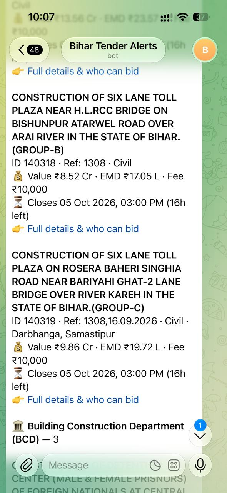
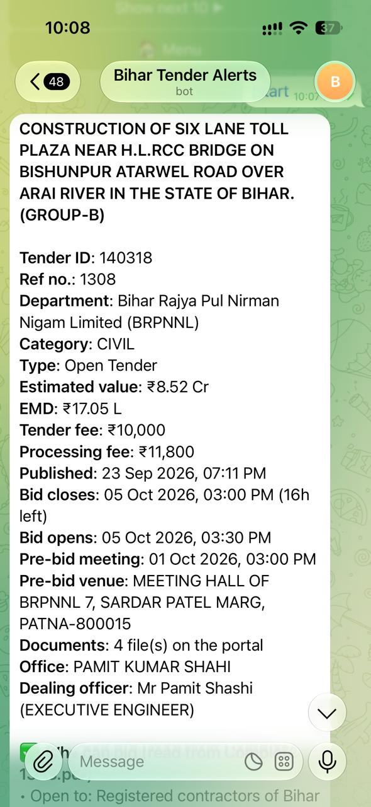
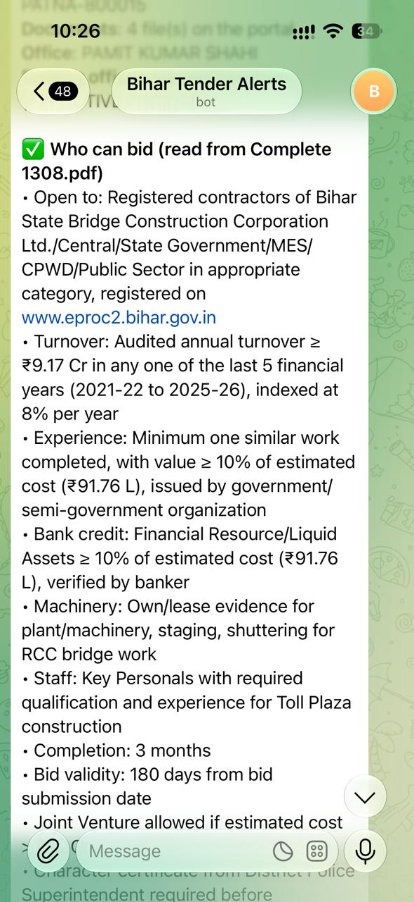
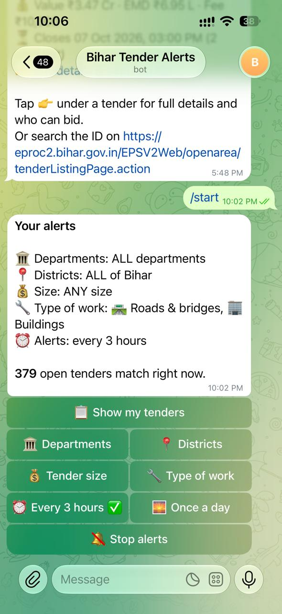
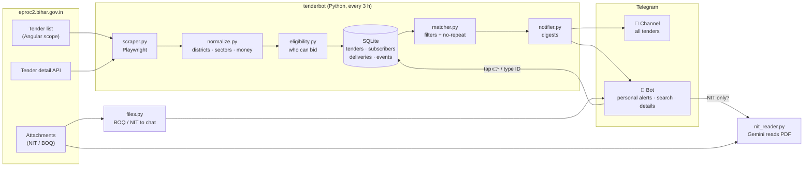

# Bihar Tender Alerts

**Personalised government-tender alerts for Bihar contractors on Telegram: every tender on the Bihar eProcurement portal, filtered by department, district and tender size, with a plain-English "who can bid" summary.**


**Live:** Telegram channel [@bihar_tender_alerts](https://t.me/bihar_tender_alerts) · bot [@biar_tender_bot](https://t.me/biar_tender_bot)

---

## The problem

Bihar publishes all government works on [eproc2.bihar.gov.in](https://eproc2.bihar.gov.in). On a normal day there are **700+ open tenders from 50+ departments**. For a contractor that means:

- **The portal is hard to use.** Many contractors don't know how to search it or open a specific tender ID, so they pay someone to check tenders for them or wait for the newspaper.
- **It isn't mobile-friendly.** On a phone you zoom and scroll through hundreds of rows, and a lot of time goes into finding the right tender.
- **Tenders get missed.** Tenders in their own district or department are easy to miss, or are noticed too late.
- **The rules are buried in the NIT.** Contractors download and read a 10–40 page NIT, often a scanned Hindi document, just to learn whether they qualify to bid.

## The existing paid answer

Commercial services already sell this as a subscription. For example, **mjPROConnect** (mjunction) offers Bihar eProcurement tender matching: you pick product and service categories, and matching new tenders are delivered to an email inbox. Its published plans are **₹15,000 for 6 months or ₹25,000 for 12 months**. That price is out of reach for many small contractors.

## What I built: the same core job, at no cost

**Bihar Tender Alerts** solves the same problem (bring the right tenders to the contractor automatically) and is **free for contractors**. It also **costs nothing to run**: it uses free tools only (Python, SQLite, the Telegram Bot API, Gemini's free tier) on a home PC.

| | Typical paid service (e.g. mjPROConnect) | Bihar Tender Alerts |
|---|---|---|
| Price for the contractor | ₹15,000 / 6 months · ₹25,000 / year | **Free** |
| Delivered to | Email inbox | **Telegram on the phone**, every 3 hours |
| How you choose tenders | Product / service categories | **Department + district + tender size** (type of work optional), all by tapping buttons |
| Deadline reminders and extensions | Not described in its offer | **Reminder before closing; alert when a deadline is extended** |
| Who can bid | Not described in its offer | **Turnover, experience, bid capacity, machinery, staff and documents**, in rupees, from the tender data or read from the NIT by AI |
| BOQ / NIT files | Not described in its offer | **One-tap download** in the chat |
| Search | Inbox | **Type `civil Patna`, `BCD` or a tender ID** |
| Running cost | Commercial subscription | **₹0** (free tools and free AI tier) |

*The mjPROConnect details are taken from its own promotional email (Oct 2026). "Not described" means its offer didn't mention the feature, not that it's absent.*

I built this first for my family's civil-contracting business, where we faced these problems ourselves, then opened it up to other contractors.

## What it does

| | |
|---|---|
| 🔎 **Reads the whole portal** | All ~700 open tenders (not just the 20 on screen), every 3 hours, plus value, EMD, fees and pre-bid date for each new tender |
| 🎯 **Personal filters** | Each user picks departments, districts and tender size (under ₹50 L, ₹50 L–2 Cr, ₹2–10 Cr, ₹10 Cr+) by tapping buttons; type of work is optional |
| 🔔 **Never the same alert twice** | New tenders, a reminder before the deadline, and a fresh alert when a deadline is extended |
| ✅ **"Who can bid"** | Turnover, similar-work experience, bid capacity, machinery, staff and documents, worked out in rupees from the tender's own data |
| 🤖 **AI reads the NIT** | When the rules exist only in the NIT PDF (scanned Hindi or English), an LLM reads it on request; each NIT is read only once |
| 📥 **BOQ / NIT download** | One tap sends the tender's BOQ or NIT file into the chat |
| 💬 **Plain-word search** | Type `civil patna`, `BCD`, `nagar nigam` or a tender ID; no commands to remember |
| 📢 **Public channel + private bot** | The channel lists every new tender; the bot gives each user their own filtered alerts and full details |
| 📊 **Owner stats** | `STATS` (owner only): channel members, bot users, searches, details opened, NITs read and downloads, plus a morning report |

### Screenshots (live bot)

| Personal alerts | Tender details | Who can bid (AI read the NIT) | Settings by tap |
|:---:|:---:|:---:|:---:|
|  |  |  |  |
| New tenders grouped by department, each with a 👉 link | Value, EMD, fees, dates, pre-bid, issuing office | Turnover ₹9.17 Cr, experience ₹91.76 L, bank credit, completion: read from the tender's NIT PDF | Everything changed with buttons, no commands |

### Example alert (Telegram)

```text
🆕 Construction of Additional work (Campus Filling, RCC Drain, Pathway & Plantation) in 10+2 High School
ID 140804 · Ref: 25/BSBCCL/2026-27 GR01 · Civil · Nalanda
💰 Value ₹2.67 Cr · EMD ₹5.34 L · Fee ₹10,000
⏳ Closes 14 Oct 2026, 03:00 PM (10 days left)
👉 Full details & who can bid
```

Tapping **Full details** opens the bot with:

```text
✅ Who can bid
• Open to: Any contractor registered with Central/State Govt or a PSU (register with Building Construction Department after award)
• Turnover: annual turnover ≥ ₹1.33 Cr (50% of cost), last 5 years
• Experience: one similar work ≥ ₹1.33 Cr (50% of cost); minimum quantities too
• Bid capacity: A×N×3 − B must exceed the bid
• Bank credit: ≥ ₹26.69 L (10% of cost)
• Machinery: Steel Shuttering 2000 Sft, Concrete Mixer 1, Vibrator (Plate & Niddle) 2, Water Tanker 1
• Staff: Site Engineer, Site Supervisor
📎 Documents to upload …          [📥 BOQ (xlsx)] [📄 NIT (pdf)]
```

## By the numbers (live database, 4 Oct 2026)

| Metric | Value |
|---|---|
| Open tenders tracked | **734** from **53** departments, ₹2,900+ Cr in total estimated value |
| Departments known | 152 |
| Tenders with value / EMD fetched | 85% |
| Tenders mapped to a district | 70% (90+ town aliases → 38 districts) |
| Structured "who can bid" from portal data | 52% (the rest: the AI reads the NIT on request) |
| Tenders with the bidder's document checklist | 100% |
| Automated tests | 41, run on real portal responses, no network needed |

## How it works



1. **Scrape.** The portal's tender table shows 20 rows, but its Angular controller already holds all ~700 tenders in `allTenderList`. One headless page load (Playwright) reads the full list. The portal blocks direct API calls from outside the browser, so the detail data (value, EMD, fees, pre-bid date, qualification rows, attachments) is fetched from inside the loaded page, only for tenders not seen before, with a 1.5 s pause between requests.
2. **Normalise and classify.** District from title and reference number (90+ town and block aliases, longest match first). Type of work from title keywords placed *before* landmarks ("RCC drain **from** Ram's house **to** Kushwaha Bhawan" is a drain, not a building). Tender size from the estimated value. Indian money format (₹ L / Cr).
3. **Who can bid.** The portal's qualification rows are free text. Regex rules pick out each requirement: turnover, experience, bid capacity (`A×N×3−B`), net worth, bank credit, machinery list, staff and contractor class. Percentages are turned into rupees using the estimated value.
4. **Store.** SQLite with a `deliveries` table keyed by *(subscriber, tender, reason)*. A tender is alerted once as `new`, once as `closing`, and again only if the deadline moves (`extended:<new date>`). The first scrape is a baseline, so nobody gets 700 "new" alerts.
5. **Match and send.** Rules of the same kind are OR'd and different kinds are AND'd (dept ∈ {BCD, RWD} AND district ∈ {Patna}). Digests are grouped by department and split under Telegram's 4,096-character limit.
6. **On demand.** Tapping a tender opens its details. If its rules are only in the NIT, a separate process downloads the PDF, sends the first 15 pages to Gemini (free tier) and stores the JSON answer. Everyone who taps later gets the stored copy. BOQ/NIT files are uploaded to Telegram once and re-sent by `file_id` after that.
7. **Run unattended.** Windows Task Scheduler runs a scrape every 3 hours and a keep-alive every 5 minutes. A socket lock keeps exactly one bot running. The bot restarts itself when the code or `.env` changes.

More detail and the reasons behind each choice are in **[docs/DESIGN.md](docs/DESIGN.md)**.

## Tech stack

- **Python 3.10+**: `requests`, `sqlite3`, `re`, `pypdf`
- **Playwright** (headless Chromium): scraping an Angular single-page app
- **SQLite** (WAL mode): tenders, events, subscribers, filters, deliveries, key-value store
- **Telegram Bot API**: long polling, inline keyboards, deep links, documents
- **Google Gemini API** (free tier): reading scanned Hindi/English NIT PDFs; Claude API supported as an alternative
- **WhatsApp Cloud API** (built, not yet switched on): template messages outside the 24-hour window
- **pytest**: 41 end-to-end tests on recorded real portal responses
- **Windows Task Scheduler + VBScript**: hidden, self-healing background operation with no admin rights

## Project structure

```text
tenderbot/
├── scraper.py        # Playwright: full tender list + in-page detail calls
├── normalize.py      # districts (90+ aliases), dates, money, detail summary
├── sectors.py        # type of work (roads, buildings, water, electrical, municipal, supply) + size bands
├── eligibility.py    # "who can bid" rules from free-text qualification rows
├── nit_reader.py     # AI reading of NIT PDFs (Gemini free tier / Claude), limits, caching
├── files.py          # BOQ / NIT download → Telegram, cached by file_id
├── db.py             # SQLite schema, upserts, deadline-extension events
├── pipeline.py       # scrape → store → fetch details (+ backfill)
├── matcher.py        # subscriber filters, no-repeat logic
├── formatter.py      # digests and detail screens (Telegram HTML / WhatsApp)
├── notifier.py       # who gets what, channel vs private, morning report
├── stats.py          # usage counters + owner report
├── supervisor.py     # single-instance lock, hidden start, auto-reload
├── commands.py       # typed commands (ADD, DISTRICT, DETAIL …)
└── channels/
    ├── telegram.py   # Bot API: send, edit, documents, polling
    ├── tg_menu.py    # tap-only menus: 3-step setup, settings, browse, details
    ├── smart.py      # plain-word search: "civil patna", "BCD", a tender ID
    └── whatsapp.py   # WhatsApp Cloud API + webhook
tests/                # 41 tests on real portal rows (tests/fixtures)
legacy/bot_v1.py      # first version (Sep 2026): top-20 tenders → one Telegram chat
*.bat / run_hidden.vbs  # Windows automation
```

## Run it yourself

```bash
git clone https://github.com/Rahulkumar2215/Bihar-Tender-Alert-Bot.git
cd Bihar-Tender-Alert-Bot
python -m venv .venv && .venv\Scripts\activate      # Linux/Mac: source .venv/bin/activate
pip install -r requirements.txt
python -m playwright install chromium
copy .env.example .env                              # add your Telegram bot token
python -m pytest -q                                 # 41 tests, no network needed
```

```bash
python -m tenderbot scrape         # first run = baseline
python -m tenderbot stats          # what is in the database
python -m tenderbot depts          # departments with open tenders
python -m tenderbot bot            # Telegram bot (keep running)
python -m tenderbot run            # scrape + send alerts (schedule every 3 h)
python -m tenderbot export open_tenders.csv   # for Excel / Power BI
```

On Windows, `setup_first_run.bat` does the setup and `install_schedule.bat` creates the background tasks.

## How it grew

| Version | What changed |
|---|---|
| **v1** (Sep 2026, `legacy/bot_v1.py`) | Scraped the 20 visible rows and posted them to one Telegram chat |
| **v2** (Oct 2026) | Full portal (~700 tenders) through the Angular scope; SQLite; no-repeat logic; deadline-extension alerts |
| | Multi-user bot with tap-only setup; district / type-of-work / size filters; public channel |
| | "Who can bid" extraction; AI reading of NITs (free Gemini tier); BOQ/NIT downloads |
| | Plain-word search; repeat-tap protection; owner stats; unattended Windows operation |

## Roadmap

- Corrigendum alerts (the portal has a public corrigendum endpoint)
- Award results and L1 rates, for pricing insight
- More portals (GeM, CPPP, IREPS) for Bihar
- Power BI dashboard on tender data: department, district, value and month trends
- Paid "Pro" tier (UPI) and WhatsApp delivery

## Notes

- Only public data from the Bihar eProcurement open area is read. Requests are spaced out and limited to new tenders.
- No secrets are in this repository: tokens and keys live in `.env`, which is git-ignored (see `.env.example`).
- The AI summary is a reading aid. Users are always told to confirm the rules in the NIT before bidding.

---

Built by **Rahul Kumar**, Patna · Data & operations for a Bihar civil-contracting business · [GitHub](https://github.com/Rahulkumar2215)
